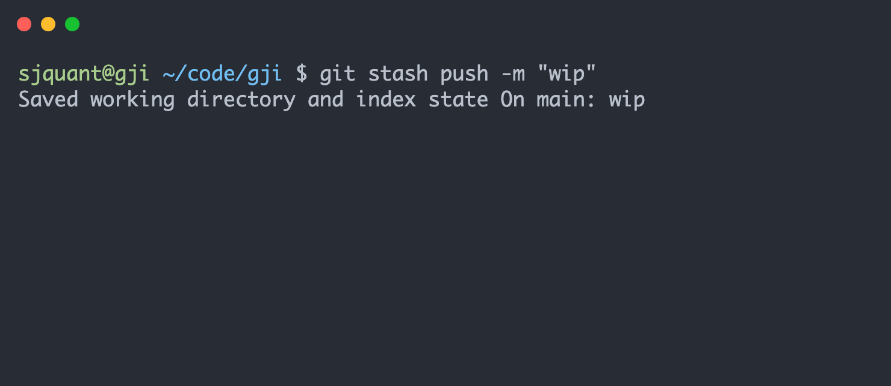
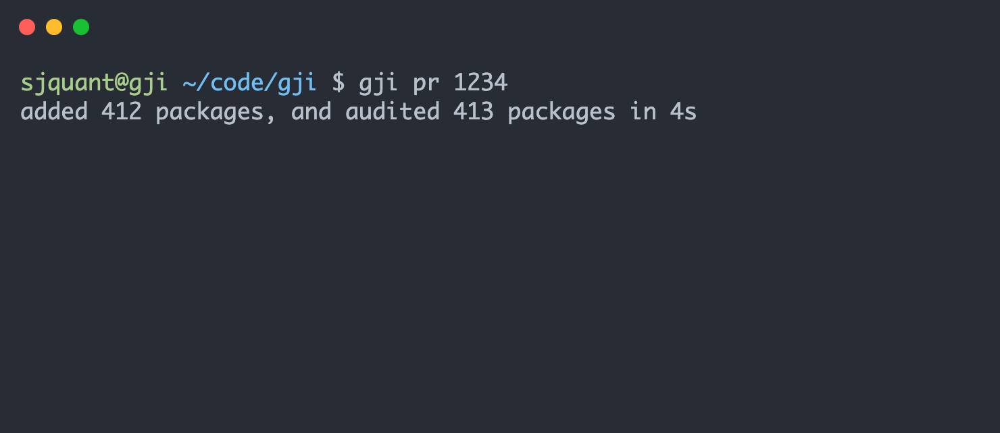

# gji — Git worktrees without the hassle

> Jump between tasks instantly. No stash. No branch juggling. No mess.

`gji` wraps Git worktrees into a fast, ergonomic CLI. Each branch gets its own directory, its own `node_modules`, and its own terminal — so switching context is a single command instead of a ritual.

That matters even more in AI-assisted workflows, where one repository often has several active tasks in parallel: your main feature, a PR review, a scratch experiment, or an agent-driven refactor. `gji` keeps each one isolated and easy to enter.

```sh
gji new feature/payment-refactor   # new branch + worktree, cd in
gji pr 1234                        # review PR in isolation, cd in
gji go main                        # jump back, shell changes directory
gji remove feature/payment-refactor
```

## Before / After

<table>
  <tr>
    <td width="50%" valign="top">
      <strong>Before</strong><br />
      
    </td>
    <td width="50%" valign="top">
      <strong>After</strong><br />
      
    </td>
  </tr>
</table>

Maintainer note: `pnpm generate:readme-demos` currently expects macOS, `zsh`, Google Chrome, `asciinema`, and `ffmpeg`.

---

**If `gji` has saved you from a `git stash` spiral, a ⭐ on [GitHub](https://github.com/sjquant/gji) means a lot — it helps other developers find this tool.**

---

## The problem

You are deep in a feature branch. A colleague asks for a quick review. You:

1. stash your changes
2. checkout their branch
3. wait for `npm install` to finish
4. review
5. checkout back
6. pop your stash
7. realize something is broken

**Or you use `gji`, run `gji pr 1234`, and let the fresh worktree boot itself.**

## Why it matters more now

AI increases the amount of parallel work around a codebase.

It is increasingly normal to have:

1. your own branch open
2. another branch for review
3. a scratch space for testing an AI-generated change
4. a separate worktree for validating a risky migration or refactor

That makes Git worktrees more important, because a single shared checkout becomes the bottleneck. `gji` turns worktrees into a daily workflow instead of a Git power-user feature.

## Install

```sh
npm install -g @solaqua/gji
```

Then add shell integration so `gji go`, `gji new`, and `gji remove` can change your directory:

```sh
# zsh
echo 'eval "$(gji init zsh)"' >> ~/.zshrc

# bash
echo 'eval "$(gji init bash)"' >> ~/.bashrc

# fish
gji init fish --write
source ~/.config/fish/config.fish
```

Install completions as separate files:

```sh
# zsh
mkdir -p ~/.zsh/completions
gji completion zsh > ~/.zsh/completions/_gji
# add this before running compinit in ~/.zshrc
fpath=(~/.zsh/completions $fpath)

# bash
mkdir -p ~/.local/share/bash-completion/completions
gji completion bash > ~/.local/share/bash-completion/completions/gji

# fish
mkdir -p ~/.config/fish/completions
gji completion fish > ~/.config/fish/completions/gji.fish
```

## Quick start

```sh
# start a new task
gji new feature/dark-mode

# start a task and open it straight in your editor
gji new feature/dark-mode --open --editor cursor

# review a pull request
gji pr 1234

# see what's open
gji status

# jump between worktrees
gji go feature/dark-mode
gji go main

# open any worktree in an editor (interactive picker)
gji open
gji open feature/dark-mode --editor code

# clean up when done
gji remove feature/dark-mode
```

Worktrees land at a deterministic path so your editor bookmarks and scripts always know where to look:

```
../worktrees/<repo>/<branch>
```

Set `worktreePath` in your config to use a different base (e.g. `"~/worktrees"` → `~/worktrees/<branch>`).

## Daily workflow

```sh
gji new feature/auth-refactor     # new branch + worktree
gji new --detached                # scratch space, auto-named

gji pr 1234                       # checkout PR locally
gji pr https://github.com/org/repo/pull/1234  # or paste the URL

gji go feature/auth-refactor      # jump to a worktree
gji root                          # jump to repo root

gji status                        # health overview + ahead/behind counts
gji ls                            # list with status/upstream/last commit
gji ls --compact                  # branch/path only

gji sync                          # rebase current worktree onto default branch
gji sync --all                    # rebase every worktree

gji clean                         # interactive bulk cleanup
gji clean --stale                 # only target safe stale cleanup candidates
gji remove feature/auth-refactor  # remove one worktree and its branch

gji trigger-hook afterCreate      # re-run setup in the current worktree
```

## Comparison

`gji` sits between raw Git primitives and larger Git or repository tools:

- **vs raw `git worktree`**: same underlying capability, but with branch-first commands, shell handoff, PR checkout, hooks, sync, and cleanup built into the workflow
- **vs `lazygit`**: `lazygit` is a broad Git UI; `gji` is narrower and faster for opening, jumping between, and removing isolated branch directories
- **vs `ghq`**: `ghq` organizes where repositories live; `gji` organizes which branch, PR, or worktree you should be in once you are inside one

Use `gji` when your bottleneck is repeated context switching between features, reviews, and maintenance work without disturbing what is already open.

It is especially useful when those contexts are happening in parallel across both human and AI-assisted work.

See the full comparison in [website/docs/comparison.mdx](./website/docs/comparison.mdx).

## Shell setup

Without shell integration `gji` prints paths and exits — which is fine for scripts but means it cannot `cd` you into a new worktree. Install the integration once:

```sh
gji init zsh   # prints the shell function, review it if you like
```

Install the wrapper once:

```sh
# zsh
echo 'eval "$(gji init zsh)"' >> ~/.zshrc

# bash
echo 'eval "$(gji init bash)"' >> ~/.bashrc

# fish
gji init fish --write
```

Install completions separately so your shell rc stays small:

```sh
# zsh
mkdir -p ~/.zsh/completions
gji completion zsh > ~/.zsh/completions/_gji
# add this before running compinit in ~/.zshrc
fpath=(~/.zsh/completions $fpath)

# bash
mkdir -p ~/.local/share/bash-completion/completions
gji completion bash > ~/.local/share/bash-completion/completions/gji

# fish
mkdir -p ~/.config/fish/completions
gji completion fish > ~/.config/fish/completions/gji.fish
```

After a reinstall or upgrade, refresh both the wrapper and the completion file:

```sh
# zsh
eval "$(gji init zsh)"
gji completion zsh > ~/.zsh/completions/_gji
# if zsh is already running, refresh completion discovery too
autoload -Uz compinit && compinit

# fish
gji init fish --write
gji completion fish > ~/.config/fish/completions/gji.fish
source ~/.config/fish/config.fish
```

For scripts that need the raw path, use `--print`:

```sh
path=$(gji go --print feature/dark-mode)
path=$(gji root --print)
```

## Commands

| Command | Description |
|---|---|
| `gji new [branch] [--detached] [--open] [--editor <cli>] [--json]` | create branch + worktree, cd in (validates branch name against Git rules) |
| `gji pr <ref> [--json]` | fetch PR ref, create worktree, cd in |
| `gji open [branch] [--editor <cli>] [--save] [--workspace]` | open a worktree in an editor |
| `gji go [branch] [--print]` | jump to a worktree |
| `gji root [--print]` | jump to the main repo root |
| `gji status [--json]` | repo overview, worktree health, ahead/behind |
| `gji ls [--compact] [--json]` | list active worktrees |
| `gji sync [--all]` | fetch and rebase worktrees onto default branch |
| `gji clean [--stale] [--force] [--json]` | interactively prune linked worktrees |
| `gji remove [branch] [--force] [--json]` | remove a worktree and its branch |
| `gji trigger-hook <hook>` | run a hook in the current worktree |
| `gji config [get\|set\|unset] [key] [value]` | manage global defaults |
| `gji init [shell]` | print or install shell integration |
| `gji completion [shell]` | print shell completion definitions |

## Configuration

No setup required. Optional config lives in:

- `~/.config/gji/config.json` — global defaults
- `.gji.json` — repo-local overrides (takes precedence)

### Available keys

| Key | Description |
|---|---|
| `branchPrefix` | prefix added to new branch names (e.g. `"feature/"`) |
| `editor` | default editor CLI for `gji open` and `gji new --open` (e.g. `"cursor"`, `"code"`, `"zed"`); set automatically with `gji open --save` |
| `worktreePath` | base directory for new worktrees (absolute or `~/…`); overrides the default `../worktrees/<repo>/` layout |
| `syncRemote` | remote for `gji sync` (default: `origin`) |
| `syncDefaultBranch` | branch to rebase onto (default: remote `HEAD`) |
| `syncFiles` | files to copy from main worktree into each new worktree |
| `skipInstallPrompt` | `true` to disable the auto-install prompt permanently |
| `installSaveTarget` | `"local"` or `"global"` — where **Always**/**Never** choices are persisted (default: `"local"`); set once during `gji init --write` |
| `hooks` | lifecycle scripts (see [Hooks](#hooks)) |
| `repos` | per-repo overrides inside the global config (see below) |

```json
{
  "branchPrefix": "feature/",
  "syncRemote": "upstream",
  "syncDefaultBranch": "main",
  "syncFiles": [".env.example", ".nvmrc"]
}
```

### Per-repo overrides in global config

If you work across many repositories, you can scope config to a specific repo inside `~/.config/gji/config.json` without adding a `.gji.json` to that repo:

```json
{
  "branchPrefix": "feature/",
  "repos": {
    "/home/me/code/my-repo": {
      "branchPrefix": "fix/",
      "hooks": {
        "afterCreate": "npm install"
      }
    }
  }
}
```

Precedence (lowest → highest): **global defaults → per-repo global → local `.gji.json`**. Hooks from all three layers are merged per key — different keys all apply, same key the higher-precedence layer wins.

### Config commands

```sh
gji config get
gji config get branchPrefix
gji config set branchPrefix feature/
gji config unset branchPrefix
```

## Hooks

Run scripts automatically at key lifecycle moments:

```json
{
  "hooks": {
    "afterCreate": "pnpm install",
    "afterEnter": "echo 'switched to {{branch}}'",
    "beforeRemove": "pnpm run cleanup"
  }
}
```

| Hook | When it runs |
|---|---|
| `afterCreate` | after `gji new` or `gji pr` creates a worktree |
| `afterEnter` | after `gji go` switches to a worktree |
| `beforeRemove` | before `gji remove` deletes a worktree |

Hooks receive `{{branch}}`, `{{path}}`, `{{repo}}` as template variables and `GJI_BRANCH`, `GJI_PATH`, `GJI_REPO` as environment variables. A failing hook emits a warning but never aborts the command.

Hooks from all three config layers merge per key — different keys from different layers both apply, same key the higher-precedence layer wins:

```jsonc
// ~/.config/gji/config.json
{ "hooks": { "afterCreate": "nvm use", "afterEnter": "echo hi" } }

// per-repo entry in ~/.config/gji/config.json
{ "repos": { "/my/repo": { "hooks": { "afterCreate": "npm install" } } } }

// .gji.json
{ "hooks": { "beforeRemove": "echo bye" } }

// effective
{ "hooks": { "afterCreate": "npm install", "afterEnter": "echo hi", "beforeRemove": "echo bye" } }
```

### Triggering hooks manually

Run any hook in the current worktree on demand:

```sh
gji trigger-hook afterCreate   # re-run the setup script
gji trigger-hook afterEnter    # re-run the enter script
gji trigger-hook beforeRemove  # dry-run the cleanup script
```

This is useful after cloning on a new machine, recovering a broken worktree, or letting an AI agent bootstrap an already-existing worktree without needing interactive prompts.

## Install prompt

When `gji new` or `gji pr` creates a worktree, `gji` detects the project's package manager from its lockfile and offers to run the install command:

```
Run `pnpm install` in the new worktree?
› Yes       run once
  No        skip this time
  Always    save as afterCreate hook
  Never     disable this prompt for this repo
```

**Always** saves `hooks.afterCreate`; **Never** writes `skipInstallPrompt: true`. Where they are saved depends on `installSaveTarget` (see [Available keys](#available-keys)) — defaults to `.gji.json`.

## JSON output

Every mutating command supports `--json` for scripting and AI agent use. Success goes to stdout, errors go to stderr with exit code 1.

```sh
# create
gji new --json feature/dark-mode
# → { "branch": "feature/dark-mode", "path": "/…/worktrees/repo/feature/dark-mode" }

# fetch PR
gji pr --json 1234
# → { "branch": "pr/1234", "path": "/…/worktrees/repo/pr/1234" }

# detailed list
gji ls --json
# → [{ "branch": "...", "status": "clean", "upstream": { "kind": "tracked", ... }, ... }]

# remove
gji remove --json --force feature/dark-mode
# → { "branch": "feature/dark-mode", "path": "/…", "deleted": true }

# bulk clean
gji clean --json --force
# → { "removed": [{ "branch": "...", "path": "..." }, …] }

# stale-only clean
gji clean --stale --json --force
# → { "removed": [{ "branch": "...", "path": "..." }, …] }

# error shape (any command)
# stderr → { "error": "branch argument is required" }
```

`gji clean --stale` limits cleanup to clean branch worktrees whose upstream is gone and whose branch is already merged into the configured or remote default branch.

`--json` suppresses all interactive prompts. `--force` is required for `remove` and `clean` in JSON mode. `branch` is `null` for detached worktrees.

`gji ls --json` and `gji status --json` also produce structured output — see `gji status --json | jq` for the full schema.

## Non-interactive / CI mode

```sh
GJI_NO_TUI=1 gji new feature/ci-branch
GJI_NO_TUI=1 gji remove --force feature/ci-branch
GJI_NO_TUI=1 gji clean --force
```

`GJI_NO_TUI=1` disables all prompts. Commands that need confirmation require `--force`. `--json` implies the same behaviour.

Update notifications are also suppressed automatically in non-interactive and `--json` runs. Users can opt out explicitly with `NO_UPDATE_NOTIFIER=1` or `--no-update-notifier`.

## Notes

- Works from either the main repo root or inside any linked worktree
- The current worktree is never offered as a `gji clean` candidate
- `gji pr` fetches from `origin` using the first matching forge ref namespace: GitHub `refs/pull/<number>/head`, GitLab `refs/merge-requests/<number>/head`, then Bitbucket `refs/pull-requests/<number>/from`

## License

MIT
