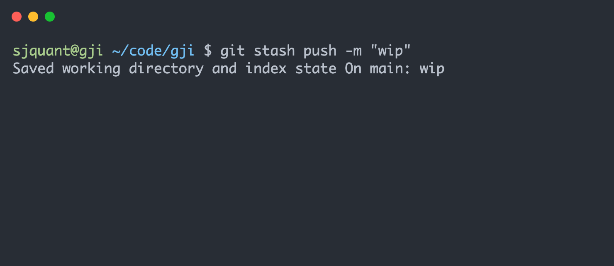
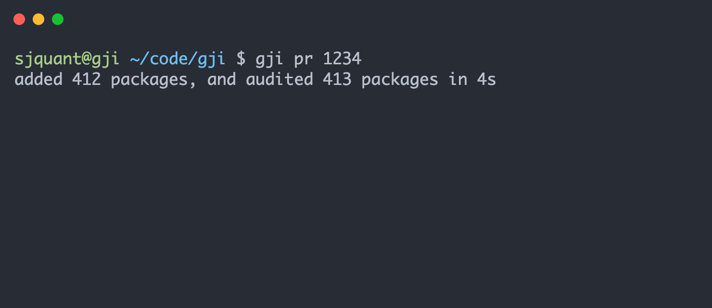

# gji — Switch Git contexts without stashing

> Start, review, and switch between Git tasks without disturbing the work already open.

`gji` makes Git worktrees feel like normal shell navigation. Each task gets its
own directory, dependencies, editor context, and terminal — so moving to a
pull request or experiment does not require stashing, checking out, or
reinstalling.

## Start your next task

Run `gji new` and let the interactive flow guide you into a fresh worktree:

```sh
gji new
```

Choose a task name and setup options, then continue working in the new
directory. For repeatable workflows, you can still provide a branch directly:

```sh
gji new feature/payment-refactor
```

## The problem

You are halfway through a feature when someone asks you to review a pull
request. Without worktrees, a quick review often becomes:

```text
stash → checkout → reinstall → review → checkout back → stash pop
```

With `gji`, the review gets its own workspace and your current task stays
untouched:

```sh
gji pr 1234
```

<table>
  <tr>
    <td width="50%" valign="top">
      <strong>Before</strong><br />
      
    </td>
    <td width="50%" valign="top">
      <strong>After</strong><br />
      
    </td>
  </tr>
</table>

## Remember four commands

```sh
gji new                            # interactively start a task
gji pr 1234                        # open a pull request in isolation
gji go main                        # jump to another worktree
gji done feature/payment-refactor  # finish and clean up a task
```

With shell integration enabled, each command moves your shell into the
selected worktree automatically.

## Install

```sh
npm install -g @solaqua/gji
gji init
```

`gji init` interactively installs shell integration, completions, and an
available editor. Restart your shell, or source the rc file shown by the
wizard, then run:

```sh
gji doctor
```

Without shell integration, commands still print paths for scripts and other
non-interactive use. See the [installation guide](https://gji.solaqua.dev/docs/installation)
for explicit shell setup.

## A typical day

```sh
# Start feature work
gji new

# Check what is active
gji

# Review a PR without changing the current task
gji pr 1234

# Move between tasks
gji go feature/payment-refactor
gji back

# Keep worktrees current and remove finished work
gji sync
gji done feature/payment-refactor
```

Worktrees use a predictable location by default:

```text
../worktrees/<repo>/<branch>
```

That keeps editor bookmarks, scripts, and terminal navigation stable.

## More capabilities

Use the documentation when you need to go beyond the core workflow:

- [Daily workflow](https://gji.solaqua.dev/docs/daily-workflow) — navigation, PRs, sync, and cleanup
- [Commands](https://gji.solaqua.dev/docs/commands) — complete command reference
- [Shell integration](https://gji.solaqua.dev/docs/shell-integration) — zsh, bash, and fish setup
- [Configuration](https://gji.solaqua.dev/docs/configuration) — paths, defaults, and local files
- [Hooks](https://gji.solaqua.dev/docs/hooks) — automate setup and cleanup
- [Sync and cleanup](https://gji.solaqua.dev/docs/sync-and-cleanup) — maintain active worktrees
- [Comparison](https://gji.solaqua.dev/docs/comparison) — `gji` vs `git worktree`, `lazygit`, and `ghq`
- [FAQ and troubleshooting](https://gji.solaqua.dev/docs/faq) — common questions and fixes

`gji` also supports JSON output for scripts and AI-assisted workflows:

```sh
gji --json
gji new --json feature/dark-mode
gji go --json feature/dark-mode
```

Read the [full documentation](https://gji.solaqua.dev) for configuration,
dependency bootstrap, hooks, automation, and the complete CLI reference.

---

If `gji` has saved you from a `git stash` spiral, a ⭐ on
[GitHub](https://github.com/sjquant/gji) helps other developers find it.

## License

MIT
